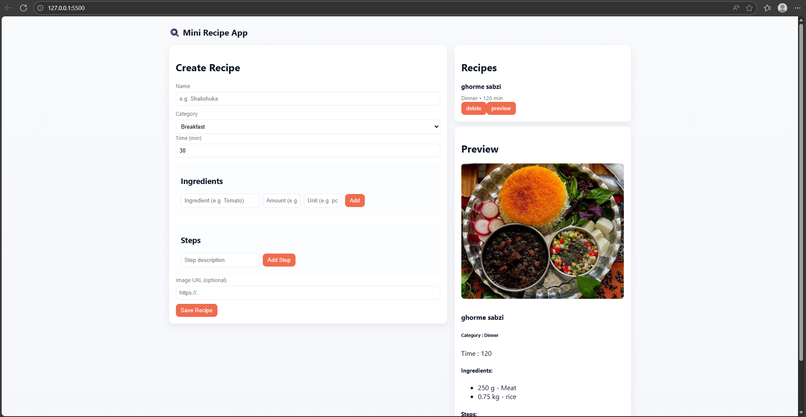

# TypeScript Recipe / Cooking App

An interactive TypeScript recipe app allowing users to browse recipes with images, ingredients, and preparation steps.

---

## ✨ Features
- Browse a list of recipes with images, ingredients, and preparation steps
- Responsive and modern UI design
- TypeScript interfaces, types, and strict type checking
- Dynamic DOM updates for interactive user experience
  
---

## 🛠️ Tech Stack
- TypeScript
- HTML5
- CSS3
- LocalStorage

---

## 🚀 How to Run
1. Clone the repository
2. Compile TypeScript to JavaScript using `tsc` (or use the precompiled JS)
3. Open `index.html` in your browser
4. Browse recipes and explore the app

---

## 🎯 Purpose of This Project
This project highlights the ability to:
- Build a fully interactive, real-world application using TypeScript
- Utilize TypeScript types and interfaces for safer, maintainable code
- Implement dynamic UI updates and user interaction
- Apply modern front-end best practices

---

## 📩 Feedback
If you have any suggestions, improvements, or feedback, feel free to open an issue or submit a pull request.
